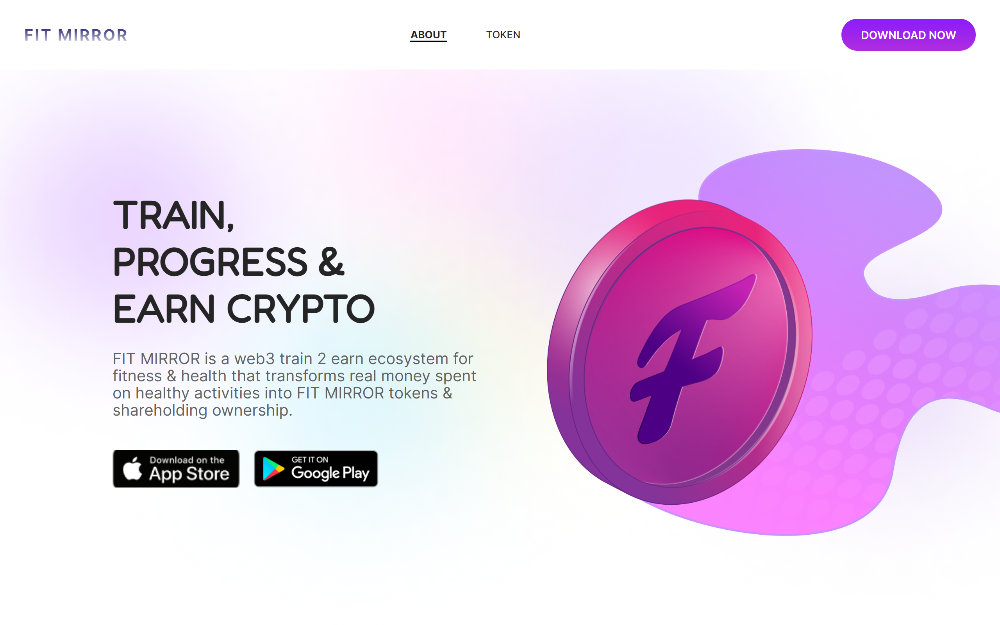

<a name="readme-top"></a>
<!-- PROJECT LOGO -->
<br />
<h1 align="center"> Fitness Mirror Template</h1>
<div align="center">
  <a href="https://fitness-mirror.vercel.app/">
    
  </a>
    <br>
    <br>
  <p align="center">
    SPA Fitness Mirror. Built with React.
    <br />
    <a href="https://reactjs.org/"><strong>Explore the docs »</strong></a>
    <br />
    <br />
    <a href="https://fitness-mirror.vercel.app/">View Demo</a>
    ·
    <a href="https://github.com/Densdix/fitness-mirror/issues">Report Bug</a>
    ·
    <a href="https://github.com/Densdix/fitness-mirror/issues">Request Feature</a>
  </p>
</div>

## Table of Contents

- [About The Project](#about-the-project)
- [Built With](#built-with)
- [Deployment](#deployment)
- [Acknowledgments](#acknowledgments)

<!-- ABOUT THE PROJECT -->
## About The Project

Modern application that built based on <a href="https://www.figma.com/file/IXp4ArehvubHwoMC7PWQXf/FINNESS?type=design&node-id=0%3A1&mode=dev">Figma template</a> using React and Tailwind CSS.

<p align="right">(<a href="#readme-top">back to top</a>)</p>


### Built With

Frameworks/libraries that used to bootstrap project:

<!-- * [![Next][Next.js]][Next-url] -->
* [![React][React.js]][React-url]
* [![TailwindCss][Tailwindcss.com]][Tailwindcss-url]
<!-- * [![Redux][Redux.js.org]][Redux-url] -->
<!-- * [![Contentful][Contentful.com]][Contentful-url] -->
<!-- * [![Vue][Vue.js]][Vue-url] -->
<!-- * [![Angular][Angular.io]][Angular-url] -->
<!-- * [![Svelte][Svelte.dev]][Svelte-url] -->
<!-- * [![Laravel][Laravel.com]][Laravel-url] -->
<!-- * [![Bootstrap][Bootstrap.com]][Bootstrap-url] -->
<!-- * [![JQuery][JQuery.com]][JQuery-url] -->
<p align="right">(<a href="#readme-top">back to top</a>)</p>

<!-- GETTING STARTED -->
## Deployment

This is an example of how you may give instructions on setting up your project locally.
To get a local copy up and running follow these simple example steps.

<!-- ### Prerequisites

This is an example of how to list things you need to use the software and how to install them.
* npm
  ```sh
  npm install npm@latest -g
  ``` -->

### Installation

1. Clone the repo
   ```sh
   git clone https://github.com/your_username_/Project-Name.git
   ```
2. Install NPM packages
   ```sh
   npm install
   ```
3. Run project
   ```sh
   npm start
   ```

<p align="right">(<a href="#readme-top">back to top</a>)</p>

<!-- ACKNOWLEDGMENTS -->
## Acknowledgments

Use this space to list resources you find helpful and would like to give credit to. I've included a few of my favorites to kick things off!

* [Figma Template](https://www.figma.com/file/IXp4ArehvubHwoMC7PWQXf/FINNESS?type=design&node-id=0%3A1&mode=dev)
* [React minimal pie chart](https://www.npmjs.com/package/react-minimal-pie-chart)
* [React Background Image with Inline CSS Style](https://www.freecodecamp.org/news/react-background-image-tutorial-how-to-set-backgroundimage-with-inline-css-style/)
* [Change direction of a gradient in tailwind CSS](https://stackoverflow.com/questions/70773146/how-do-i-change-the-direction-of-a-gradient-in-tailwind-css)
* [Шпаргалка по Flexbox CSS](https://tpverstak.ru/flex-cheatsheet/)
* [Free icons](https://icons8.ru/)
* [How to Add a CSS reset to React app](https://reactgo.com/react-css-reset/)
* [How to import Google Web Font in CSS file](https://stackoverflow.com/questions/14676613/how-to-import-google-web-font-in-css-file)
* [Figma Source](https://pintait.com/figma-fitness-mirror/)

<p align="right">(<a href="#readme-top">back to top</a>)</p>


<!-- MARKDOWN LINKS & IMAGES -->
<!-- https://www.markdownguide.org/basic-syntax/#reference-style-links -->
<!-- https://shields.io/badges/static-badge -->
<!-- https://simpleicons.org/ -->
[contributors-shield]: https://img.shields.io/github/contributors/othneildrew/Best-README-Template.svg?style=for-the-badge
[contributors-url]: https://github.com/othneildrew/Best-README-Template/graphs/contributors
[forks-shield]: https://img.shields.io/github/forks/othneildrew/Best-README-Template.svg?style=for-the-badge
[forks-url]: https://github.com/othneildrew/Best-README-Template/network/members
[stars-shield]: https://img.shields.io/github/stars/othneildrew/Best-README-Template.svg?style=for-the-badge
[stars-url]: https://github.com/othneildrew/Best-README-Template/stargazers
[issues-shield]: https://img.shields.io/github/issues/othneildrew/Best-README-Template.svg?style=for-the-badge
[issues-url]: https://github.com/othneildrew/Best-README-Template/issues
[license-shield]: https://img.shields.io/github/license/othneildrew/Best-README-Template.svg?style=for-the-badge
[license-url]: https://github.com/othneildrew/Best-README-Template/blob/master/LICENSE.txt
[linkedin-shield]: https://img.shields.io/badge/-LinkedIn-black.svg?style=for-the-badge&logo=linkedin&colorB=555
[linkedin-url]: https://linkedin.com/in/othneildrew
[product-screenshot]: images/screenshot.png
[Next.js]: https://img.shields.io/badge/next.js-000000?style=for-the-badge&logo=nextdotjs&logoColor=white
[Next-url]: https://nextjs.org/
[React.js]: https://img.shields.io/badge/React-20232A?style=for-the-badge&logo=react&logoColor=61DAFB
[React-url]: https://reactjs.org/
[Vue.js]: https://img.shields.io/badge/Vue.js-35495E?style=for-the-badge&logo=vuedotjs&logoColor=4FC08D
[Vue-url]: https://vuejs.org/
[Angular.io]: https://img.shields.io/badge/Angular-DD0031?style=for-the-badge&logo=angular&logoColor=white
[Angular-url]: https://angular.io/
[Svelte.dev]: https://img.shields.io/badge/Svelte-4A4A55?style=for-the-badge&logo=svelte&logoColor=FF3E00
[Svelte-url]: https://svelte.dev/
[Laravel.com]: https://img.shields.io/badge/Laravel-FF2D20?style=for-the-badge&logo=laravel&logoColor=white
[Laravel-url]: https://laravel.com
[Bootstrap.com]: https://img.shields.io/badge/Bootstrap-563D7C?style=for-the-badge&logo=bootstrap&logoColor=white
[Bootstrap-url]: https://getbootstrap.com
[JQuery.com]: https://img.shields.io/badge/jQuery-0769AD?style=for-the-badge&logo=jquery&logoColor=white
[JQuery-url]: https://jquery.com 
[Redux.js.org]: https://img.shields.io/badge/redux-764ABC?style=for-the-badge&logo=redux&logoColor=white
[Redux-url]: https://redux.js.org
[Tailwindcss.com]: https://img.shields.io/badge/Tailwind%20CSS-06B6D4?style=for-the-badge&logo=tailwindcss&logoColor=white
[Tailwindcss-url]: https://tailwindcss.com/ 
[Contentful.com]: https://img.shields.io/badge/Contentful-2478CC?style=for-the-badge&logo=contentful&logoColor=white
[Contentful-url]: https://contentful.com/